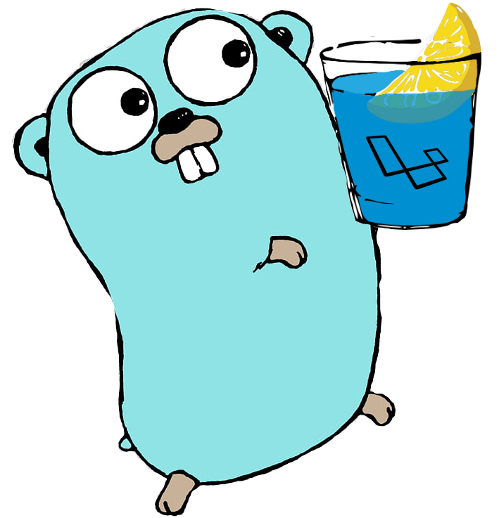

<!-- PROJECT LOGO -->
<br />
<p align="center">

  <a href="https://github.com/larago-go/larago">
    
  </a>

  <h3 align="center">LARAGO</h3>

  <p align="center">
    Structure-inspired laravel written in langue Go
    <br />
    <a href="https://github.com/larago-go/larago"><strong>Useful links and documents »</strong></a>
    <br />
    <br />
    <a href="https://github.com/gin-gonic/gin">Gin framework</a>
    ·
    <a href="https://gorm.io/docs/">ORM GORM</a>
    ·
    <a href="https://docs.mongodb.com/manual/crud/">MongoDB Crud</a>
    ·
    <a href="https://github.com/casbin/casbin">Casbin Role</a>
  </p>
</p>


<!-- TABLE OF CONTENTS -->
## Table of Contents

* [About the Project](#about-the-project)
* [Specification](#specification)
* [Getting Started](#getting-started)
  * [Installation](#installation)
* [License](#license)
* [Contact](#contact)
* [CRUD(creating a model, controller, views)](#CRUD)


<!-- ABOUT THE PROJECT -->
## About The Larago
![Product Name Screen Shot][product-screenshot]

Structure-inspired laravel written in langue Go. The classic structure of the MVC with the implementation of basic authorization and a role management system
 

<!-- Specification -->
## Specification

Supports data bases mysql, postgres, sqlite, sqlserver and mongoDB. Session storage cookie, memcache and redis.

Under the hood:

* Gin framework - heart of the project (route, middleware, html template and other) 
* ORM GORM - the fantastic ORM library for Golang (Supports data bases mysql, postgres, sqlite, sqlserver and crud)
* MongoDB - MongoDB (Supports data bases mongoDB and crud) see [https://github.com/larago-go/larago-mongodb](https://github.com/larago-go/larago-mongodb)
* Casbin - An authorization library that supports access control models like ACL, RBAC, ABAC for Golang


<!-- GETTING STARTED -->
## Getting Started

To get a local copy up and running follow these simple steps.


### Installation

1. Clone the repository to the src/ folder of your directory $GOPATH: [https://golang.org/doc/gopath_code.html](https://golang.org/doc/gopath_code.html)

```sh
git clone https://github.com/larago-go/larago.git
```
2. Install NPM packages
```sh
npm install
```
and
```sh
npm run dev
```
3. Rename the file .env.example
```sh
mv .env.example .env
```

4. Сreate a database by default this is mysql(when creating use utf8mb4), you can change it by uncomplexing the necessary values in the files /config/Database.go and /config/CasbinRole.go

5. configure the file .env

6. inside your project run the command
```sh
go run main.go
```

7. go to address
```sh
http://localhost:8080/
```
enjoy!


<!-- CRUD(creating a model, controller, views) -->
## CRUD
CRUD(creating a model, controller, views) | 
View and edit the file crud.bash
```sh
set up variables
model=ExampleModel
model_l=examplemodel
model_url=example
controller=ExampleController
fields=('Title  string `gorm:"column:title"`' 'Text  string `gorm:"column:text"`' 'Author  string `gorm:"column:author"`')
```
```sh
run
sh crud.bash
```

<!-- LICENSE -->
## License

Distributed under the MIT License. See `LICENSE` for more information.


<!-- CONTACT -->
## Contact


Project Link: [https://github.com/larago-go/larago](https://github.com/larago-go/larago)
Author Link: [https://github.com/GuzhavinAleksey](https://github.com/GuzhavinAleksey)

<!-- IMAGES -->

[product-screenshot]: larago_git.png
